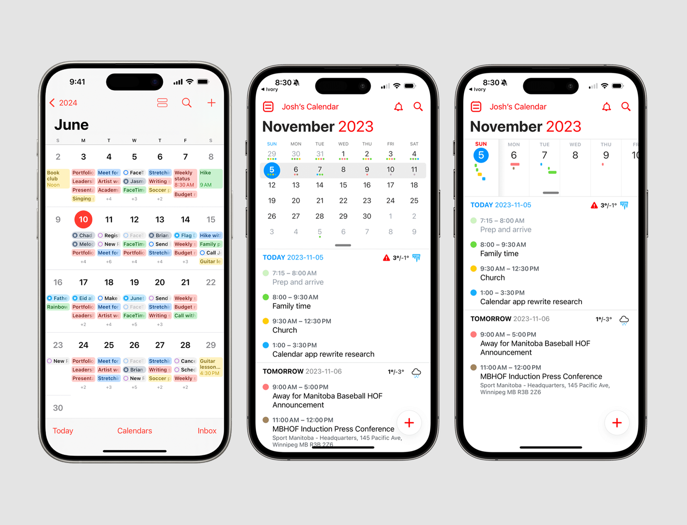

# **DiyetTakvim**


<p align="center">
  
</p>


DiyetTakvim, diyetisyenler ve danışanlar için geliştirilen, randevu yönetimi, danışan takibi ve veri analizi odaklı dijital bir takvim ve planlama sistemidir. Proje hem mobil uygulama hem de web platformu olarak tasarlanmıştır. Amaç, diyetisyenlerin operasyonel yükünü azaltmak ve danışan takibini daha sistematik hale getirmektir.


## **Proje Amacı**


Diyetisyenlerin manuel olarak yürüttüğü randevu planlama, danışan takip ve veri analiz süreçlerini dijitalleştirerek daha verimli bir çalışma ortamı oluşturmak. Aynı zamanda danışanların randevu oluşturma ve süreç takibini kolaylaştırmak.


## **Hedef Kitle**

Diyetisyenler

Beslenme uzmanları

Online danışmanlık veren sağlık profesyonelleri

Diyetisyen danışanları


## **Temel Özellikler**
Diyetisyen ve danışan için ayrı kullanıcı kayıt ve giriş sistemi

Randevu oluşturma, görüntüleme ve yönetme

Diyetisyene özel takvim paneli

Danışan ilerleme takibi

Geçmiş randevu ve veri kayıt sistemi

Web sitesi üzerinden randevu oluşturma imkanı

Geçmiş aylara ait verilerle analiz altyapısı

Yapay zeka destekli aylık yoğunluk tahmini sistemi

Yapay Zeka ve Veri Analizi

DiyetTakvim, geçmiş randevu verilerini analiz ederek gelecekteki aylık yoğunluğu tahmin etmeyi hedefler. Bu sistem, ortalama hava durumu ve önceki ay verilerini dikkate alarak diyetisyenlerin planlama yapmasına yardımcı olur.


## **Teknolojiler**

SwiftUI (iOS mobil uygulama)

Web Frontend (planlanan

Backend servis altyapısı (planlanan)

Veri analizi ve tahmin modeli (geliştirme aşamasında)


## **Platformlar

iOS Mobil Uygulama

Web Uygulaması


## Docker ve Docker Compose

Yerelde tüm bağımlılıklarla ayağa kaldırmak için (MongoDB, Redis, RabbitMQ, backend, frontend):

```bash
docker compose up --build
```

- **mongo**: Uygulama veritabanı (`MONGO_URI` içinde `mongo` hostname).
- **redis**: Önbellek / kuyruk için hazır servis; backend konteynerinde `REDIS_URL=redis://redis:6379`.
- **rabbitmq**: AMQP broker (`rabbitmq:3-management`); AMQP **5672**, yönetim arayüzü **15672** (`http://localhost:15672`, varsayılan kullanıcı `guest` / `guest`). Backend’de `RABBITMQ_URL=amqp://rabbitmq` (Docker ağında `infra/rabbitmq/rabbitmq.conf` ile guest erişimi açıktır; **production’da güçlü kullanıcı kullanın**).
- **backend**: Node API (`http://localhost:5050`).
- **frontend**: Nginx üzerinde derlenmiş web arayücü (`http://localhost:5173`).

Örnek ortam değişkenleri için `backend/.env.example` dosyasına bakın. **RabbitMQ** şu an yalnızca altyapı olarak compose’ta durur (uygulama kodu henüz tüketici yazmıyor). **Redis** ise `REDIS_URL` tanımlıysa gerçek HTTP önbelleği için kullanılır; tanımlı değilse API doğrudan veritabanına gider (davranış değişmez). **Kalori AI önizlemesi** için `OPENAI_API_KEY` gerekir — yoksa ilgili endpoint hata verir, sunucu yine ayağa kalkar.

Durdurmak için: `docker compose down` (veriler named volume’larda kalır; tam silmek için `docker compose down -v`).

### Redis önbelleği (backend)

**Amaç:** Yoğun okunan listeleri veritabanından tekrar tekrar çekmeyi azaltmak; yanıt gövdesi (JSON) aynı kalır.

**Ortam:** `REDIS_URL` (Docker Compose’ta `redis://redis:6379`). Sunucu açılışında `backend/config/redis.js` ile bağlantı kurulur; hata olursa API çalışmaya devam eder, sadece önbellek kullanılmaz.

**Önbelleğe alınan uç noktalar (yanıt şekli değişmez):**

| Uç nokta | TTL | Anahtar mantığı |
|----------|-----|------------------|
| `GET .../appointments/daily?date=YYYY-MM-DD` | 60 sn | `diyettakvim:daily:{diyetisyenId}:{date}` |
| `GET .../appointments/monthly` veya `.../monthly-summary` | 300 sn | `diyettakvim:monthly:{diyetisyenId}:{year}:{month}` |
| `GET .../appointments/available-slots` veya `.../availability` | 60 sn | `diyettakvim:slots:{diyetisyenId}:{date}` |
| `GET .../dietitians/{id}/clients` | 120 sn | `diyettakvim:clients:{diyetisyenId}` |

**Geçersiz kılma (invalidation):**

- Randevu **oluşturma / güncelleme / iptal** → ilgili diyetisyen için o günün `slots` + `daily` + o ayın `monthly` anahtarları silinir (tarih taşınırsa eski ve yeni gün/ay).
- **Çalışma saatleri** güncellemesi (`PATCH`/`POST .../auth/availability` ve eşdeğerleri) → o diyetisyenin tüm `slots:*`, `daily:*`, `monthly:*` önbellekleri silinir.
- **Danışan listesi** etkileyen durumlar → `diyettakvim:clients:{diyetisyenId}` silinir (ör. danışan bağlantı onayı; hesap silme sırasında bağlı diyetisyen veya diyetisyen hesabının silinmesi).

Konsolda örnek loglar: `[redis] hit: ...`, `[redis] miss: ...`, `[redis] invalidated: ...`.

**Lokal / Docker test senaryosu**

1. `docker compose up --build` ile stack’i kaldırın.
2. Diyetisyen token’ı ile `GET http://localhost:5050/api/appointments/daily?date=2026-04-20` — terminalde `[redis] miss:` görmelisiniz.
3. Aynı isteği hemen tekrarlayın — `[redis] hit:` ve DB’ye gitmeden hızlı yanıt.
4. Aynı token ile randevu oluşturun / güncelleyin / iptal edin veya çalışma saatlerini değiştirin; ardından `daily` isteğinde yine `miss` (önbellek temizlendi) görmelisiniz.
5. Redis kapalıysa (`REDIS_URL` yok) tüm istekler doğrudan MongoDB’ye gider; `hit`/`miss` logları oluşmaz.

## CI/CD — Jenkins pipeline

Kök dizinde bulunan `Jenkinsfile`, monorepo yapısında **backend** ve **frontend** için bağımlılık kurulumu, frontend üretim derlemesi, ardından proje kökündeki `docker-compose.yml` ile imajların oluşturulması ve stack’in **detached** modda ayağa kaldırılması adımlarını içerir. Son aşamada `docker compose ps` ve konteyner içinden HTTP ile kısa bir **smoke** kontrolü yapılır (API: mevcut `GET /api/water-intake/health`; web: compose ağındaki `http://frontend/`). Production’a dağıtım yoktur; amaç yerel/ders ortamında uçtan uca akışı göstermektir.

**Pipeline adımları (özet):**

1. Depo checkout  
2. `backend/` içinde `npm ci`  
3. `frontend/` içinde `npm ci`  
4. `frontend/` içinde `npm run build`  
5. `docker compose config -q` ile yapılandırma doğrulaması  
6. `docker compose build`  
7. `docker compose up -d`  
8. `docker compose ps` ve smoke HTTP kontrolleri  
9. Başarılı tamamlanınca konsolda özet mesaj  
10. Hata durumunda aşama başarısız olur ve `post { failure { ... } }` ile bilgi satırı yazılır  

Pipeline, stack’i durdurmak için `docker compose down` **çalıştırmaz** (mevcut ortamdaki diğer süreçlere müdahale etmemek için). Gerekirse stack’i elle durdurmak için yine `docker compose down` kullanabilirsiniz.

### Jenkins’i çalıştırmak

Jenkins’i Docker ile çalıştırıyorsanız, derste kullanılan kuruluma göre örnek adres **`http://localhost:8080`** (veya eğitmenin verdiği port) olabilir. Jenkins konteynerinde **Docker CLI**’ın çalışması ve host’taki Docker soketine erişim (ör. `/var/run/docker.sock` bağlama) gerekir; böylece pipeline içindeki `docker compose` komutları host üzerindeki Docker’a gider ve `docker-compose.yml` içindeki port yayınları (5050, 5173 vb.) **host makinenizin** `localhost` adresine bağlanır.

**Önkoşullar:** Jenkins ajanında `git`, `node` / `npm` (pipeline `npm ci` ve `npm run build` için), `docker` ve `docker compose` v2 bulunmalıdır.

### Jenkins’te job oluşturma

1. Jenkins ana sayfasında **New Item** seçin.  
2. Bir ad verin (ör. `DiyetTakvim-CI`).  
3. **Pipeline** türünü seçip **OK** ile ilerleyin.  
4. **Pipeline** bölümünde **Definition** alanında **Pipeline script from SCM** seçin.  
5. **SCM:** Git; **Repository URL:** bu projenin Git adresi; gerekirse branch (`main` / `master` vb.).  
6. **Script Path:** `Jenkinsfile` (kökte olduğu gibi bırakın).  
7. **Build Triggers:** Ders için yalnızca manuel çalıştıracaksanız burayı boş bırakabilirsiniz.  
8. **Save** ile kaydedin.

### Pipeline’ı tetikleme

- Job sayfasında **Build Now** ile manuel tetikleyebilirsiniz.  
- İsterseniz SCM polling veya webhook ile otomatik tetik tanımlayabilirsiniz (ders kapsamı dışında opsiyoneldir).

### Demo / sunumda gösterilebilecek URL’ler

| Ne | Örnek URL | Not |
|----|-----------|-----|
| Web arayüzü (Docker Compose) | `http://localhost:5173` | `frontend` servisi (host portu) |
| REST API (Docker Compose) | `http://localhost:5050` | `backend` servisi; Swagger/OpenAPI genelde `http://localhost:5050/api-docs` |
| RabbitMQ yönetim paneli | `http://localhost:15672` | Varsayılan kullanıcı/parola: `guest` / `guest` (yalnızca güvenilir ortamda) |
| Jenkins | `http://localhost:8080` | Kurulumunuza göre port farklı olabilir |

**Smoke açıklaması:** Jenkins ajanı başka bir konteynerde olduğundan, pipeline içindeki HTTP kontrolleri doğrudan host `localhost` yerine **`docker compose exec` ile `backend` konteyneri içinden** yapılır; böylece Docker ağı ve servis isimleri tutarlı kalır. Tarayıcıdan gösterim için yine yukarıdaki `localhost` adreslerini kullanın.

---

## **Dokümantasyon**
**1.** [Gereksinim Analizi](DiyetTakvim/Gereksinim-Analizi.md)

**2.** [Rest API Tasarımı](API-Tasarimi.md)

**3.** [Rest API](Rest-API.md)

**4.** [Web Front-End](Web-Frontend.md)


